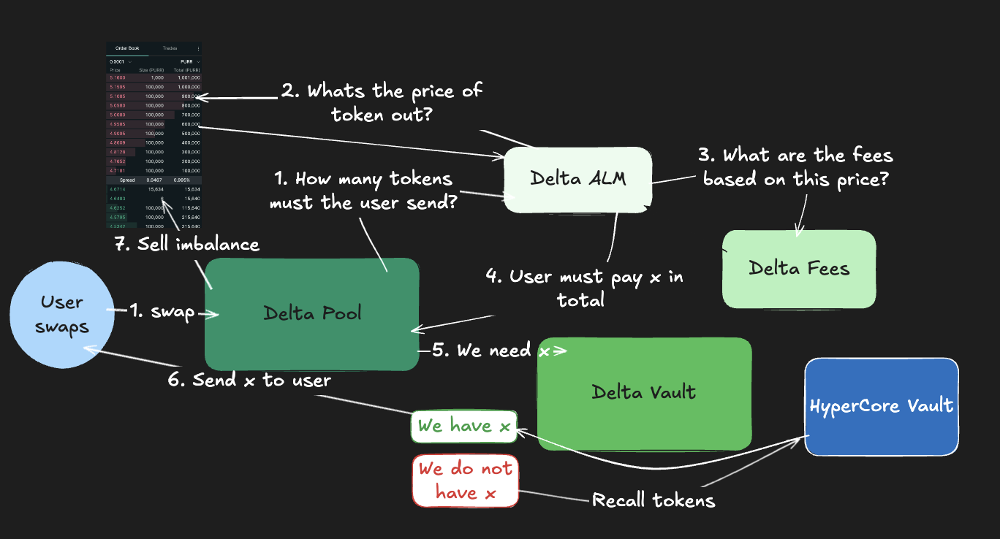

# Delta Flow

[Live UI](https://hyperliquid-hack-frontend-h6kqohyup-samuel-parkes-projects.vercel.app/)

Delta Flow is a highly composable and precise AMM inspired by the Valantis Sovereign Pool architecture.

While popular AMMs like Uniswap have started to integrate more functionality - for example, Uniswap v4 hooks - several constraints still exist. One example is reserve-based pricing. For large trades in low-liquidity pools, the pool price can deviate far from the true market price, resulting in high slippage costs for the end-user.

Delta Flow brings a new class of AMMs to market that: prices swaps based on spot prices, apply dynamic fees based pool value imbalances, allows for the allocation of excess liquidity to HyperCore vaults, and recalls liquidity from vaults to traders if the vault has insufficent liquidity.



## Delta Flow has three modules:

- Delta Vault
- Delta ALM
- Delta Swap-Fee

## Delta Vault

A module which:

- Holds all pool assets
- Allows a strategist to deploy excess capital to a HyperCore Vault
- Provides the tokens for a swap in the Delta Pool
- Recalls the tokens from vault positions if the vault is short in existing reserves

Because pricing is anchored to spot markets, the pool does not naturally rebalance through arbitrage the way constant-product AMMs do. Without a rebalance mechanism, a pool could be drained of one token if it is repeatedly swapped out.

To counter this, Sovereign vault sells the token with higher reserves on the spot market for the token with less reserves.

## Delta ALM

A module which calculates the price for an asset to be swapped.

Delta ALM reads from the HyperEVM precompile contract to get the mid spot price, calculates the total value of the other token needed for the trade (USDC in our product), and returns this amount for the user to swap in.

This prevents the reserve-based price drift described above.

## Delta Swap-Fee

A module which dynamically calculates fees based on deviations within pool reserves.

The pool aims to maintain a 1:1 USDC value ratio:

- the USDC value of token X reserves must equal the USDC value of token Y reserves.

To further avoid deviations in pool balances, we apply a linearly increasing fee for every 0.01% deviation.

Target condition (healthy state):

```
USDC/PURR * spot price
```

### Frontend

```bash
pnpm install
pnpm dev
```

### How to deploy

## Setting up .env (for HyperLiquid testnet)

```
TESTNET_RPC_URL=https://rpc.hyperliquid-testnet.xyz/evm
CHAIN_ID=998
ALCHEMY_WS_URL= #needed for contract event listening
STRATEGIST_EVM_PRIVATE_KEY=
USDC=0x2B3370eE501b4a559b57D449569354196457D8Ab
PURR=0xa9056c15938f9aff34cd497c722ce33db0c2fd57
REBALANCE_BAND=0.015
HL_AGENT_NAME=insert-name
INVERT_PURR_PX=false
ENABLE_HL_TRADING=true
HL_SECRET_KEY=
HL_ACCOUNT_ADDRESS=
SOVEREIGN_VAULT_ADDRESS=
WATCH_POOL=
PROTOCOL_FACTORY=
VERIFIER_MODULE=
POOL_MANAGER=
# Swap fee params
DEFAULT_SWAP_FEE_BIPS=15

# Fee module params
BASE_FEE_BIPS=15
MIN_FEE_BIPS=5
MAX_FEE_BIPS=1000
PENALTY_SLOPE_BIPS_PER_SHARE_BPS=1
DISCOUNT_SLOPE_BIPS_PER_SHARE_BPS=1
LIQUIDITY_BUFFER_BPS=50
DEADZONE_IMBALANCE_BIPS=200
PENALTY_SLOPE_BIPS_PER_PCT=5
DISCOUNT_SLOPE_BIPS_PER_PCT=5
```

## Deployment

```shell
$ forge clean            
$ forge build
$ forge script contracts/script/DeployAll.s.sol:DeployAll  --rpc-url $TESTNET_RPC_URL  --broadcast -vvvv
```

## Backend Server

```shell
$ pip install dotenv asyncio fastapi web3 websockets
$ python backend/server.py
```

### Live Demo:

https://hyperliquid-hack-frontend.vercel.app/